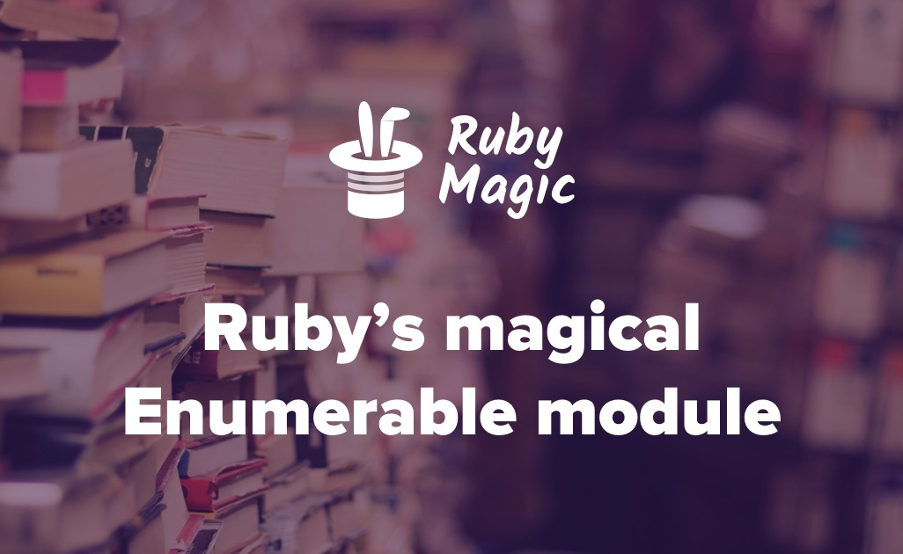

# Enumerables

This project has been built in order to recreate Ruby methods like `.count`, `.inject`, `.map` and so on. The main purpose of it to increase Ruby knowledge related to methods and blocks. 

### There is some detailed information about these methods in Ruby.

- `.each` — this method takes two arguments—an element and a block. If no block is given, an enumerator is returned instead. The  clone of this method in the project is `.my_each`

- `.each_with_index` — this method calls block with two arguments, the item and its index, for each item in enum. Given arguments are passed through to each(). If no block is given, an enumerator is returned instead. The  clone of this method in the project is `.my_each_with_index`

- `.select` — this method returns an array containing all elements of enum for which the given block returns a true value. If no block is given, an enumerator is returned instead. The  clone of this method in the project is `.my_select`

- `.all?` — this method passes each element of the collection to the given block. The method returns true if the block never returns false or nil. If the block is not given, Ruby adds an implicit block of { |obj| obj } which will cause all? to return true when none of the collection members is false or nil. The  clone of this method in the project is `.my_all?`

- `.any?` — this method passes each element of the collection to the given block. The method returns true if the block ever returns a value other than false or nil. If the block is not given, Ruby adds an implicit block of { |obj| obj } that will cause any? to return true if at least one of the collection members is not false or nil. The  clone of this method in the project is `.my_any?`

- `.none?` — this method passes each element of the collection to the given block. The method returns true if the block never returns true for all elements. If the block is not given, none? will return true only if none of the collection members is true. The  clone of this method in the project is `.my_none`

- `.count` — this method returns the number of items in enum through enumeration. If an argument is given, the number of items in enum that are equal to the item are counted. If a block is given, it counts the number of elements yielding a true value. The  clone of this method in the project is `.my_count`

- `.map` — this method Returns a new array with the results of running block once for every element in enum. If no block is given, an enumerator is returned instead. The  clone of this method in the project is `.my_map`
- `.inject` — Combines all elements of enum by applying a binary operation, specified by a block or a symbol that names a method or operator. If you specify a block, then for each element in enum the block is passed an accumulator value (memo) and the element. If you specify a symbol instead, then each element in the collection will be passed to the named method of the memo. In either case, the result becomes the new value for the memo. At the end of the iteration, the final value of the memo is the return value for the method. If you do not explicitly specify an initial value for the memo, then the first element of the collection is used as the initial value of the memo. The  clone of this method in the project is `.my_inject`

- Also created `multiply_els` method to test `.my_inject`.

## Built With

<code></code> Ruby

## Getting Started

To get a local copy up and running follow these simple steps.

- `git clone https://github.com/AbdumurodovaZulfizar/Enumerables.git`
- `cd Enumerables`
- Open this repository on your device

## Authors

👩🏻‍💼 **Zulfizar Abdumurodova**

- GitHub: [Zulfizar Abdumurodova](https://github.com/AbdumurodovaZulfizar)
- Twitter: [Zulfizar Abdumurodova](https://twitter.com/Zulfiza70357085)
- LinkedIn: [Zulfizar Abdumurodova](https://www.linkedin.com/in/zulfizar-abdumurodova-a61527206/)

## 🤝 Contributing

Contributions, issues, and feature requests are welcome!

## Show your support

Give a ⭐️ if you like this project!

## Acknowledgments

- [Microverse](https://www.microverse.org/) for international opportunities and their `README` [template](https://github.com/microverseinc/readme-template).

## 📝 License

Copyright 2021 Zulfizar Abdumurodova
- [Apache License](https://github.com/AbdumurodovaZulfizar/Enumerables/blob/enum/feature-branch/LICENSE.md) for this project.
